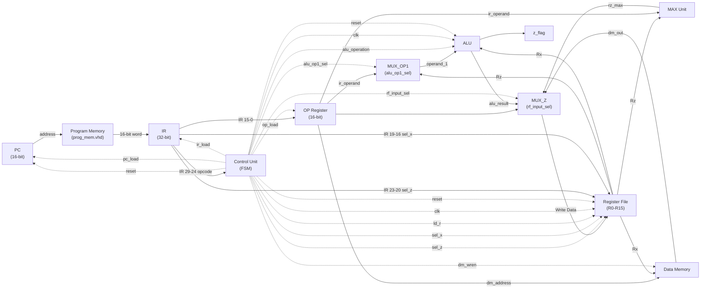
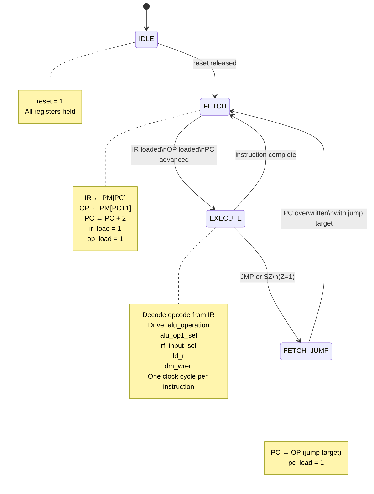

# ReCOP Datapath Diagrams

## Lab 0 / GP1 Datapath

```mermaid
flowchart LR

%% ===== Fetch Path =====
PC["PC\n(16-bit)"]
PM["Program Memory\n(prog_mem.vhd)"]
IR["IR\n(32-bit)"]
OPR["OP Register\n(16-bit)"]

PC -->|address| PM
PM -->|16-bit word| IR
IR -->|IR 15-0 | OPR

%% ===== Register File =====
RF["Register File\n(R0-R15)"]

%% ===== MUX for Write Back =====
MUXZ["MUX_Z\n(rf_input_sel)"]

%% ===== ALU Input MUX =====
MUX1["MUX_OP1\n(alu_op1_sel)"]

%% ===== ALU =====
ALU[ALU]
Z[z_flag]

%% ===== MAX Unit =====
MAX[MAX Unit]

%% ===== Data Memory =====
DM[Data Memory]

%% ===== Data connections =====

%% Write-back path into Register File
MUXZ -->|Write Data| RF

%% RF outputs
RF -->|Rz| MUX1
RF -->|Rx| ALU

%% OP Register feeds the datapath (replaces external ir_operand in Lab 0)
OPR -->|ir_operand| MUX1
OPR -->|dm_address| DM
OPR --> MUXZ

%% ALU connections
MUX1 -->|operand_1| ALU
ALU -->|alu_result| MUXZ
ALU --> Z

%% MAX unit (for MAX instruction)
RF -->|Rz| MAX
OPR -->|ir_operand| MAX
MAX -->|rz_max| MUXZ

%% Memory connections
RF -->|Rx| DM
DM -->|dm_out| MUXZ

%% ===== Control Signals =====
CU["Control Unit\n(FSM)"]

CU -. alu_op1_sel .-> MUX1
CU -. alu_operation .-> ALU
CU -. rf_input_sel .-> MUXZ
CU -. sel_z .-> RF
CU -. sel_x .-> RF
CU -. ld_r .-> RF
CU -. dm_wren .-> DM
CU -. clk .-> RF
CU -. clk .-> ALU
CU -. reset .-> RF
CU -. reset .-> ALU
CU -. reset .-> PC
CU -. pc_load .-> PC
CU -. ir_load .-> IR
CU -. op_load .-> OPR

%% IR decoded fields feed Control Unit and RF selects
IR -->|IR 29-24 opcode| CU
IR -->|IR 23-20 sel_z| RF
IR -->|IR 19-16 sel_x| RF
```

---

## Control Unit FSM

```mermaid
stateDiagram-v2

    [*] --> IDLE

    IDLE --> FETCH : reset released

    FETCH --> EXECUTE : IR loaded\nOP loaded\nPC advanced

    EXECUTE --> FETCH : instruction complete

    EXECUTE --> FETCH_JUMP : JMP or SZ\n(Z=1)

    FETCH_JUMP --> FETCH : PC overwritten\nwith jump target

    note right of IDLE
        reset = 1
        All registers held
    end note

    note right of FETCH
        IR ← PM[PC]
        OP ← PM[PC+1]
        PC ← PC + 2
        ir_load = 1
        op_load = 1
    end note

    note right of EXECUTE
        Decode opcode from IR
        Drive: alu_operation
               alu_op1_sel
               rf_input_sel
               ld_r
               dm_wren
        One clock cycle per instruction
    end note

    note right of FETCH_JUMP
        PC ← OP (jump target)
        pc_load = 1
    end note
```
