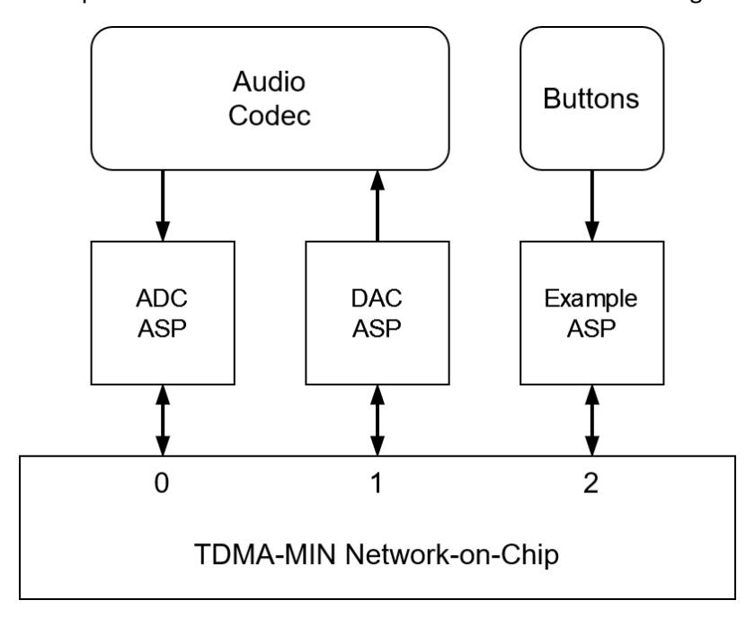
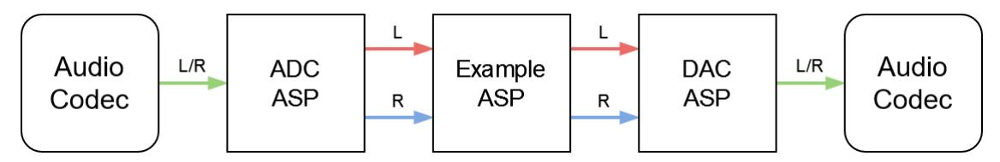
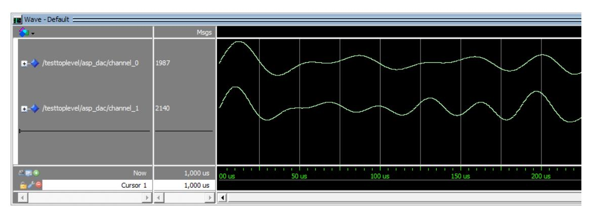

## COMPSYS 701 Lab 2 – Network-on-Chip Reference Design

University of Auckland, Department of Electrical, Computer, and Software Engineering Semester 1, 2026

# 1. Introduction

The NoC reference design is a full design of a small NoC based on TDMA-MIN. Working with the reference design establishes hands-on experience with the TDMA-MIN NoC implemented in FPGA, and it will be the key exercise before integrating various components/nodes into the final HMPSoC.

The purpose of this lab/assignment is to introduce a meaningful application of TDMA-MIN NoC presented in lectures. As a starting point, a reference design that provides a parameterized TDMA-MIN NoC is given, where the parameters are (1) number of physical ports that correspond to networked nodes (special purpose processors, general purpose processors or application specific processors in any combination) and (2) number of bits that are transferred through the NoC in one clock cycle (also equal to the width of data path within TDMA-MIN NoC).

Also, the reference design provides three simple networked nodes, which can communicate each with the other by sending fixed size packets and can be configured to provide fixed routing of packets within the NoC. Two nodes are connected to an external Audio Codec that serves as both source of stream of data into the reference design and sink to the stream obtained by transforming/processing data in NoC-based multimode/multi-core system. The Audio Codec is used as a suitable example of external environment that can communicate with reference design and indicates how other environments can be interfaced with the nodes connected to NoC. The third node provides a simple UI with couple of push buttons (keys) that can be used to issue commands which generate messages/packets to configure functionalities of the other nodes. This node can also accommodate and implement application-specific functions on the stream of data received from a NoC node and forward the results to another NoC node. All three nodes are considered application specific processors (ASP) as they implement application specific functionalities in custom hardware.

In the Lab 3, teams of two students will demonstrate ability to use, customize and extend the reference design, as it will be a major cornerstone of the group research project. Two major customizations need to be done:

- (1) Introduction of a simple new ASP node (fourth node) for processing of data stream received from external environment through another existing reference design ASP in network and generating data stream that will be forwarded to the third ASP for presentation to the external environment
- (2) Extension of the reference design to interface with (a) standard traditional microcomputer based on Nios II, and/or (b) reactive ReCOP-based microcomputer as the nodes of NoC-based system. The focus in this assignment is on connecting Nios II based nodes to the NoC and demonstration it can communicate with other nodes (e.g. on data stream processing or configuration and call of the functions implemented on those nodes).

## 2. Reference Design Overview

The reference design (RD), shown in Figure 1, represents a simple modular system for processing data streams. It consists of three application-specific processors (ASP) connected to the TDMA-MIN NoC using three ports with addresses 0, 1 and 2. Communication between the nodes is implemented using a message-based protocol with messages/packets of the fixed size (design selectable). The design's environment includes a pair of input/output audio signals and a set of three push buttons (keys). The FPGA development kit provides the audio and IO interface to the reference design.

Figure 1 Reference design global view

The analogue audio signal is automatically converted to digital and back from digital to analogue by a hardware codec on the development kit board. The blue **line-in** jack on the board captures the input, and the green **line-out** jack transmits the output. There are two independent audio channels that correspond to the left and right components of stereo sound. Each channel is sampled at the standard rate of 48 kHz, and their values(samples) are represented digitally as 16-bit signed integers. The audio module communicates with the codec using the Inter-IC Sound (I²S) protocol. It provides a parallel interface for the rest of the NoC-based system using one input FIFO and one output FIFO.

The provided RD is a small foundational demonstration example design for the development of heterogeneous multi-node platforms that can have general-purpose and application-specific processors as its nodes and use TDMA-MIN to enable single-hop/single-cycle communication between any two nodes with full time predictability (see more in Group Project brief).

### 2.1 Application-specific processors

The reference design consists of three ASPs connected via TDMA-MIN with the primary focus of demonstrating the communication of these ASP nodes with each other and communication with the external environment (Audio Codec). In addition to TDMA-MIN, the NoC provides a basic network interface (NI) with a FIFO queue for each node with an 8-bit network address and 32-bit data interface (40 bits in total).

The ADC-ASP node manages the data streams generated by the analog-to-digital converters (ADC, one for each channel) of the Audio Codec. Its purpose is to forward the data to another node on the network for processing. The streams corresponding to left and right audio component of the sound are created and managed separately and may be sent to different nodes for further processing. The ADC-ASP may also optionally reduce the transmission rate by effectively down-sampling received data stream. Down-sampling ratio can be changed by selecting specific parameter value in configuration message/packet received from another network node using a specific network message during change of configuration of ADC-ASP node (see Section 2.3).

The DAC-ASP node manages the data streams received after processing on another system node(s), preparing them and delivering to the digital-to-analog converters (DAC) of the audio codec. Like the ADC-ASP, the left and right streams are managed separately and may have their transmission rate reduced. Configuration of the DAC-ASP is similarly changed using its specific network message format.

The third node, Example-ASP, provides interface with the simple I/O of the FPGA development board. Its purpose is to demonstrate the operation of the system comprised of three nodes. The Example-ASP is used to send configuration messages to the ADC-ASP and DAC-ASP to set up the data streams and determine the destination node for the stream generated on the output of these nodes, as well as to provide trivial processing of input streams, e.g. simply dropping some data samples. The Example-ASP also uses simple push buttons to transfer requests for generation of configuration messages and commands to ADC-ASP and DAC-ASP. In case of the RD, these messages are "hardcoded".

Initial configuration of all nodes must be done before system starts with its operation, and subsequently can be changed by a node which typically controls the operation of the system in runtime.

### 2.2 System operation

The ADC-ASP and DAC-ASP nodes are initially disabled and will not process any data packets. Pressing the rightmost button on the board (KEY0) commands the Example-ASP to send the necessary configuration messages. The ADC-ASP is set to relay both channels to the Example-ASP, which will forward the messages to the DAC-ASP, which is set to send both processed left and right channels to the codec. This configuration is shown visually in Figure 2. The red and blue paths are implemented through TDMA-MIN. The button can also be pressed again to toggle the nodes back to their initial offstate. The Example-ASP will forward any data it receives to the DAC-ASP unless the associated mute button is pressed. KEY2 mutes the left channel, and KEY1 mutes the right channel.

Figure 2. Configuration implemented in reference design

### 2.3 Network protocol

Communication over the network uses the message/packet-based protocol. The most significant bit (31) indicates whether a message is present. All valid packets must have it set to 1. The second bit (30) indicates whether it is a standard message or a user-defined extension. This format allows extra functionality to be added by packets starting with "11". The standard protocol uses the following two bits (29-28) to specify the message type, as shown in Figure 3.

|            |    | Bits |    |    |            |         |          |    |      |      |                   |                       |
|------------|----|------|----|----|------------|---------|----------|----|------|------|-------------------|-----------------------|
|            | 31 | 30   | 29 | 28 | 27 26 25 2 | 4 23 22 | 21 2     | 20 | 19 1 | .8 1 | 7 16              | 15 14 13 12 11 10 0   |
| Data-Audio | 1  | 0    | 0  | 0  | Dest       |         | Reserved |    |      |      | Ch                | 16-bit signed integer |
| Conf-DP    | 1  | 0    | 0  | 1  | Dest       | Ne      | ext      |    | Mode |      | e                 | Unused                |
| Conf-ADC   | 1  | 0    | 1  | 0  | Dest       | Ne      | ext      |    | SR   | E    | <mark>n</mark> Ch | Unused                |
| Conf-DAC   | 1  | 0    | 1  | 1  | Dest       | Rese    | rved     | ı  | SR   | E    | n Ch              | Unused                |

Figure 3. Message formats

The data format is used to pass data between pairs of nodes in the network. The configuration formats are the interface to set the operating parameters of the ASP nodes. Every standard message includes space for an optional destination address (**Dest**) of the message. This field allows for less complex implementations of the network interface if needed by the node. The channel bit (**Ch**) specifies to which channel the packet relates. A value of 0 is the left channel, and a value of 1 is the right.

The enable bit (**En**) indicates whether the ADC-ASP or DAC-ASP should process the specified channel. It can be either disabled (0) or enabled (1). The sample rate field (**SR**) configures the divisor for a rate reduction. The options are no reduction (00), a quarter (01), a sixteenth (10), or one in 256 (11). The next address field (**Next**) configures where to forward the data after processing. This field makes it possible to establish different processing pipelines using ASP nodes as the pipeline stages.

The mode field (**Mode**) specifies operation codes of operations a data processor (DP-ASP) can perform on the data. There are no specified values for this field; it depends on the functionality of each DP-ASP and is left to the designers to decide. Note that a DP-ASP is assumed to process only one stream, so the configuration message does not specify a channel. This format could be used for a more complex custom platform if necessary.

#### 2.4 Example sound waves

A sound wave generator, written in Python, is provided with its resulting output. The file is a 10-second WAV file consisting of a different set of tones on each channel. It can be played on a computer or phone connected to the board. A template test bench for ModelSim is provided that simulates a simplified version of the ADC-ASP and DAC-ASP communicating via TDMA-MIN.

#### 2.5 Resource file

The RD zip file contains a Quartus Prime project and its directories for the Altera IP blocks, the project source code, some test benches, and an example waveform.

| ip/*                  | Altera IP for FIFOs and PLL                        |  |  |  |  |  |  |
|-----------------------|----------------------------------------------------|--|--|--|--|--|--|
| src/Audio/*           | Control and interface for audio CODEC              |  |  |  |  |  |  |
| src/TdmaMin/*         | Network on chip (TDMA-MIN)                         |  |  |  |  |  |  |
| src/AspAdc.vhd        | ASP for the incoming data                          |  |  |  |  |  |  |
| src/AspDac.vhd        | ASP for the outgoing data                          |  |  |  |  |  |  |
| src/AspIo.vhd         | ASP for the example configuration                  |  |  |  |  |  |  |
| src/TopLevel.vhd      | Top-level showing modules and their connections |  |  |  |  |  |  |
| test/Audio/*          | Test benches for audio components               |  |  |  |  |  |  |
| test/TdmaMin/*        | Test benches for network components             |  |  |  |  |  |  |
| test/TestAdc.vhd      | Simulation of the ADC                              |  |  |  |  |  |  |
| test/TestDac.vhd      | Simulation of the DAC                              |  |  |  |  |  |  |
| test/TestTopLevel.vhd | Template test bench                             |  |  |  |  |  |  |
| tones/tones.py        | Script to create tones                             |  |  |  |  |  |  |
| tones/tones.wav       | Example tones for testing                          |  |  |  |  |  |  |

## 3. Lab 2 tasks

The lab has the following major goals and tasks:

- (1) Familiarization with reference design using simulation (ModelSim) and simplified system functionality:
  - 1. Introduce to the reference design
    - o Each port (tdma\_min\_port) has two fields (addr and data)
    - o Network address is 8 bits
    - o Network data is 32 bits (16 bits control, 16 bits signed audio)
  - 2. Introduce to the testbench (ModelSim) (1 mark)

- o Compile TestToplevel, TestAdc, and TestDac
- o Simulate TestToplevel
- o Add wave for channel\_0 and channel\_1 from TestDac
- o Run for 1ms
- o Set wave Radix to Decimal
- o Set wave format to Analog (automatic)
- (2) Create a new Data Processing ASP (DP-ASP) node and check its operation in simulation (1 mark)
  - a. Needs 3 ports: clock, send, recv (same as TestAdc and TestDac)
  - b. Check incoming packet is audio data
  - c. Use the received value in the packet as a payload and along with three immediate preceding values/samples to calculate a moving average of four values (signal samples) (averaging window is 4 samples)
  - d. Double the average value from task c, then ensure absolute of the received value is max 4096 (clip the value)
  - e. Send new clipped value to DAC-ASP (send.addr is 1)
  - f. Add component to TestToplevel (with port 3)
  - g. Update TestAdc to forward to port 3 (DP-ASP, Data Processing ASP))
  - h. Confirm and verify result in simulation

(3) Modify the design after adding DP-ASP to run on the FPGA development kit

(3 marks)

- a. Increases number of ports in NoC (in TopLevel)
- b. Add new DP-ASP component (with port 3)
- c. Update AspExample configuration packets for the new component

The following two tasks, (4) and (5), are optional. You may want to try them as a preparation for designing the HMPSoC:

- (4) Add one more port to NoC and connect Nios II as a node
  - a. Use NiOS II parallel port to connect to a NoC port (you can use a port that was used to connect Example-ASP by removing Example-ASP or use a completely new NoC port)
  - b. Try some meaningful applications of NiOS II (e.g. as a configurator of the processing pipeline where it replaces UI interface of Example-ASP and/or acts as a receiver of the processed stream)
- (5) Instead of Nios II in task (4), use ReCOP processor as a node; this requires a proper hardware interface of ReCOP with the NoC and write a short assembly language program that implements a simple application (e.g., configurator of all other nodes in the system, which includes reception of confirmations that configuration was successful, as well as implements the UI interface of Example-ASP eliminating the need to have it at all).