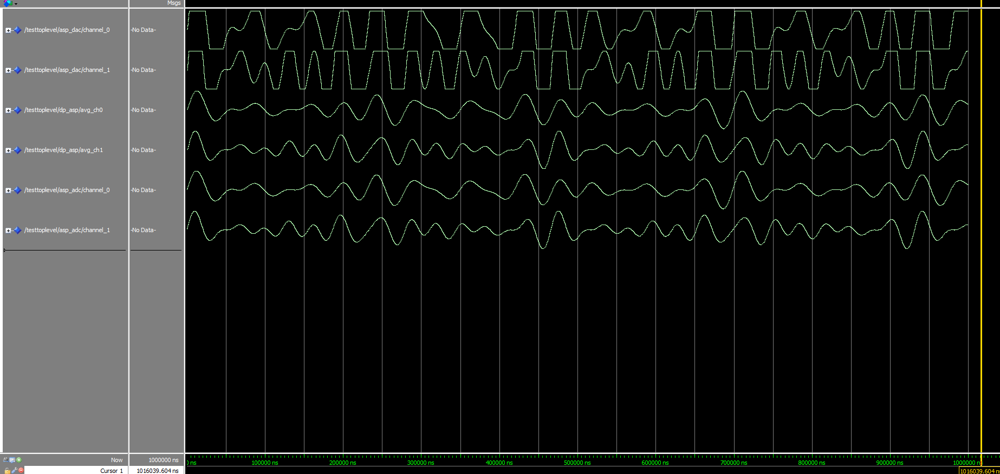

# COMPSYS 701 Lab 2 Report

## Task 2: Data Processing ASP (DP-ASP) in Simulation

New component: `src/DpAsp.vhd`

A new ASP entity `DpAsp` was created with the following ports:

| Port    | Direction | Description                   |
| ------- | --------- | ----------------------------- |
| `clock` | in        | System clock                  |
| `key`   | in        | 4-bit button input (for mute) |
| `send`  | out       | Output NoC port               |
| `recv`  | in        | Input NoC port                |

**Processing pipeline (per clock cycle, on valid Data-Audio packet):**

1. Validate incoming packet: `recv.data(31 downto 28) = "1000"`
2. Shift new sample into a per-channel 4-sample window (separate registers for `ch0` and `ch1` to avoid mixing interleaved stereo packets)
3. Sum the 4 samples in 18-bit signed arithmetic (4 &times; 16-bit max = &plusmn;131068, overflows 16 bits), then divide by 4 via arithmetic right-shift by 2
4. Double the average in 17-bit signed (&times;2 can reach &plusmn;65534, overflows 16 bits), then clip to &plusmn;4096
5. Mute check: `KEY2` mutes channel 0 (left), `KEY1` mutes channel 1 (right)
6. Forward to DAC-ASP at port `1` with channel bit preserved

### Changes to testbench

| File                    | Change                                                                                               |
| ----------------------- | ---------------------------------------------------------------------------------------------------- |
| `test/TestTopLevel.vhd` | `forward` generic on `TestAdc` changed from `1` to `3`; `DpAsp` added at port 3 with `key => "1111"` |

### Simulation result

---

## Task 3 — DP-ASP Integration on FPGA

`src/TopLevel.vhd`

- `ports` generic increased from `3` to `4`
- Set `enable_adc` to `true` in generic map
- `DpAsp` instantiated at port `3`, with `key => KEY` connected to the DE1-SoC push buttons

`src/AspExample.vhd`

The ADC enable configuration packets in states 7 and 6 were updated to route the ADC output to the DP-ASP (port 3) instead of the Example-ASP (port 2):

| State              | Old packet    | New packet    |
| ------------------ | ------------- | ------------- |
| 7 (enable ADC ch0) | `x"a0220000"` | `x"a0320000"` |
| 6 (enable ADC ch1) | `x"a0230000"` | `x"a0330000"` |
